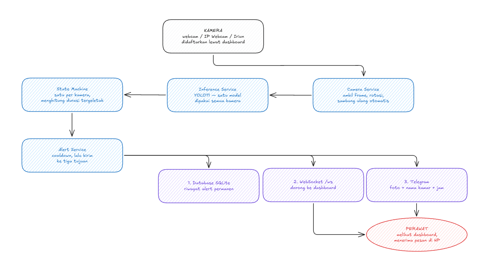
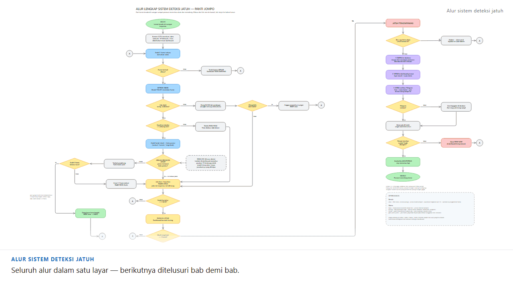
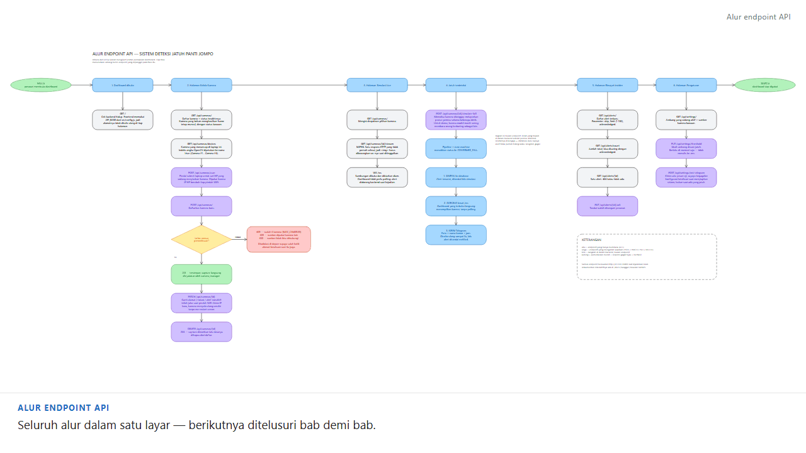
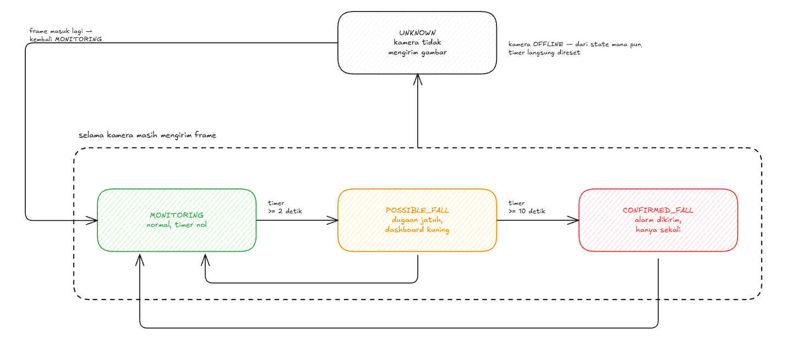

# Fall Detection System — Nursing Home Monitoring

Sistem deteksi jatuh real-time untuk panti jompo menggunakan YOLO11 computer vision, FastAPI backend, dan React dashboard.

---

## Architecture



**Flow:** Kamera menangkap video → YOLO11 mendeteksi postur (normal/transitional/lying_on_ground) per frame → State machine menghitung durasi "lying_on_ground" → Jika melebihi threshold → Kirim alert Telegram + tampilkan di dashboard.

### Alur lengkap, langkah demi langkah



Lihat detail lengkap di [docs/architecture.md](docs/architecture.md).

---

## Project Structure

```
nursing-home-fall-detection/
├── ml/              # Dataset, training, dan bobot model YOLO11
├── backend/         # FastAPI: REST, WebSocket, pipeline deteksi
├── frontend/        # React + Vite dashboard
├── docs/            # Dokumentasi, sumber flowchart, dan GIF-nya
├── deployment/      # docker-compose + template .env
├── tools/           # Skrip bantu (uji kamera, chat_id Telegram, pembuat GIF)
├── run-backend.bat  # Jalankan backend
└── run-frontend.bat # Jalankan dashboard
```

Isi `backend/app/` dipisah menurut siapa yang memiliki state:

| Folder | Isi |
|---|---|
| `api/` | Endpoint REST — hanya **membaca** state, tidak memilikinya |
| `services/` | Komponen murni: YOLO11, state machine, kamera, overlay, Telegram |
| `runtime/` | State yang hidup selama aplikasi berjalan (registry, pipeline, manajer kamera) |
| `db/` | SQLite + SQLAlchemy async; semua query SQL hanya ada di `repository.py` |
| `websocket/` | Broadcast alert ke dashboard |

---

## Quick Start (Development Lokal)

Perintah di bawah untuk **Windows PowerShell**, dijalankan dari **root repo**, dan sudah
diuji pada clone baru.

> Pakai branch **`integration`** kalau ingin menjalankan sistemnya. Branch `backend`
> hanya memuat sisi backend; frontend di dalamnya versi lama dan belum punya halaman
> Kelola Kamera maupun Simulasi Live.

### Yang harus terpasang lebih dulu

| Kebutuhan | Versi | Cara memastikan |
|---|---|---|
| Python | **3.12** | `py -0p` — harus ada baris `-3.12` |
| Node.js | 18+ | `node --version` |
| Git | — | `git --version` |
| File model `best.pt` | EXP-006 | **tidak ada di repo** — lihat [langkah 3](#3-taruh-file-model) |

> Harus **3.12**. `ultralytics` belum punya wheel untuk 3.13+, pemasangannya akan gagal.

### 1. Clone

```powershell
git clone https://github.com/0Raja0-RA/nursing-home-fall-detection.git
cd nursing-home-fall-detection
git switch integration
```

### 2. Pasang dependensi Python

Virtual environment dibuat di **root repo**, bukan di dalam `backend/` — launcher
mengandalkan letak itu.

```powershell
py -3.12 -m venv .venv
.venv\Scripts\python.exe -m pip install --upgrade pip
.venv\Scripts\python.exe -m pip install -r backend\requirements.txt
```

Unduhannya sekitar 1 GB karena PyTorch ikut terbawa. Tidak perlu `activate`; semua
perintah memanggil `.venv\Scripts\python.exe` langsung.

Pastikan berhasil — tahap ini belum butuh model, kamera, maupun internet:

```powershell
.venv\Scripts\python.exe -m pytest backend\tests -q
```

### 3. Taruh file model

`git clone` **tidak** memberimu file modelnya — bobot `.pt` dikecualikan lewat
`.gitignore`. Minta `best.pt` hasil **EXP-006** ke anggota ML, lalu taruh di:

```
ml\models\fall_detection\weights\best.pt
```

Tanpa file itu backend tetap menyala tapi tidak mendeteksi apa pun.

Periksa file yang kamu terima — bobot COCO bawaan YOLO (`yolo11n.pt`) berukuran mirip dan
mudah tertukar, dan kalau tertukar kelasnya kacau tanpa pesan error:

```powershell
.venv\Scripts\python.exe -c "from ultralytics import YOLO; print(YOLO('ml/models/fall_detection/weights/best.pt').names)"
```

| Yang muncul | Artinya |
|---|---|
| `{0: 'normal', 1: 'transitional', 2: 'lying_on_ground'}` | Benar |
| 80 kelas berisi `person`, `car`, dst. | **Salah** — itu bobot COCO, minta ulang |

### 4. Jalankan

```powershell
.\run-backend.bat
```

Di terminal lain:

```powershell
.\run-frontend.bat
```

| Alamat | Isi |
|---|---|
| http://localhost:5173 | Dashboard |
| http://127.0.0.1:8000/docs | Dokumentasi API interaktif |

Saat pertama dijalankan, satu kamera dibuat otomatis dari `CAMERA_SOURCE` di
`run-backend.bat` (bawaannya `0`, webcam laptop). Selanjutnya kamera diatur dari
dashboard — lihat [Mengelola Kamera](#mengelola-kamera).

### 5. (Opsional) Notifikasi Telegram

Tanpa langkah ini sistem tetap berjalan penuh; hanya notifikasi ke HP yang tidak dikirim.

```powershell
copy backend\.env.example backend\.env
```

Isi `TELEGRAM_BOT_TOKEN` dengan token dari [@BotFather](https://t.me/BotFather), lalu
ambil `chat_id` tujuannya:

```powershell
.venv\Scripts\python.exe tools\get_chat_id.py
.venv\Scripts\python.exe tools\get_chat_id.py --simpan <chat_id>
```

Jalankan ulang backend, lalu uji:

```powershell
curl.exe -s -X POST http://127.0.0.1:8000/api/settings/test-telegram
```

> Tulis `curl.exe`, bukan `curl` — di PowerShell `curl` adalah alias `Invoke-WebRequest`
> yang tidak mengenal `-X`.

Saat ada yang jatuh, grup menerima foto kejadian beserta bounding box, nama kamar,
durasi, dan jam. Kegagalan kirim tidak membatalkan alert: barisnya tetap tersimpan
dengan `notified: false`.

### 6. (Opsional) Training ulang model

```powershell
.venv\Scripts\python.exe ml\training\train.py --config ml\training\config.yaml
```

Perlu dataset format YOLO di `ml/data/processed/`. Hasilnya tersimpan di lokasi yang sama
dengan yang dicari backend, jadi tidak perlu menyalin apa pun. File `.pt` tidak ikut
ter-commit; kirimkan langsung ke anggota tim lain kalau perlu.

> `ml/data/processed/data.yaml` sengaja memakai `path:` kosong supaya berfungsi di
> komputer siapa pun. **Jangan mengisinya dengan path absolut** — berkas itu akan rusak
> untuk semua orang selain pengisinya.

---


## Docker Deployment

> **Belum diuji, dan diketahui belum sesuai.** Berkas Compose dan Dockerfile masih dari
> kerangka awal proyek: `backend/Dockerfile` memakai `python:3.11-slim`, padahal
> `ultralytics` butuh 3.12. Jalur Docker juga belum menangani akses kamera dari dalam
> container, yang di Windows tidak sesederhana memasang volume.
>
> Untuk sekarang, pakai `run-backend.bat` dan `run-frontend.bat` di Quick Start.

```bash
cd deployment
docker compose up --build
```

---

## API Endpoints

| Method | Endpoint                     | Description                                        |
| ------ | ---------------------------- | -------------------------------------------------- |
| GET    | `/`                          | Health check                                        |
| GET    | `/api/alerts/`               | Daftar alert (pagination)                           |
| GET    | `/api/alerts/count`          | Hitung total alert                                  |
| GET    | `/api/alerts/{id}`           | Detail satu alert                                   |
| PUT    | `/api/alerts/{id}/ack`       | Acknowledge alert                                   |
| GET    | `/api/cameras/`              | Daftar kamera + status runtime-nya                  |
| POST   | `/api/cameras/`              | Daftarkan kamera baru (sumber divalidasi dulu)      |
| GET    | `/api/cameras/{id}`          | Satu kamera                                         |
| PATCH  | `/api/cameras/{id}`          | Ubah nama/sumber/rotasi/enabled, pipeline restart   |
| DELETE | `/api/cameras/{id}`          | Matikan dan hapus kamera                            |
| GET    | `/api/cameras/{id}/stream`   | Video MJPEG dengan bounding box tergambar           |
| GET    | `/api/cameras/devices`       | Kamera lokal (webcam, Iriun) beserta namanya        |
| POST   | `/api/cameras/scan`          | Pindai subnet lokal untuk mencari kamera IP         |
| GET    | `/api/settings/`             | Konfigurasi aktif                                   |
| PUT    | `/api/settings/threshold`    | Update threshold durasi                             |
| POST   | `/api/cameras/{id}/simulate-fall` | Paksa simulasi jatuh (untuk demo)              |
| POST   | `/api/settings/test-telegram`| Kirim notifikasi uji ke Telegram                    |
| WS     | `/ws`                        | WebSocket live updates                              |

Dokumentasi interaktif tersedia di `http://127.0.0.1:8000/docs` saat server berjalan.

### Kapan tiap endpoint dipanggil

Tabel di atas mengelompokkan endpoint per router. Animasi di bawah menyusunnya ulang
mengikuti **urutan pemakaian dashboard** — dari halaman dibuka, mendaftarkan kamera,
menonton stream, sampai menindaklanjuti alert — sehingga terlihat endpoint mana memanggil
apa dan respons gagal apa saja yang mungkin muncul.



---

## Mengelola Kamera

Daftar kamera disimpan di database, **bukan** di environment variable, dan diatur lewat
halaman **Kelola Kamera** di dashboard. Alasannya praktis: alamat IP kamera HP berubah
setiap kali berpindah jaringan WiFi, dan mengubahnya tidak boleh berarti menyunting kode
lalu me-restart server.

| Jenis sumber | Nilai | Catatan |
| --- | --- | --- |
| Webcam laptop | `0` | |
| Iriun (kamera HP sebagai webcam) | `1`, `2`, `3`, `4` | tekan **Pindai** untuk melihat namanya |
| IP Webcam (Android) | `http://IP-HP:8080/video` | jangan lupa `/video` di belakang |
| RTSP / CCTV | `rtsp://IP:554/...` | |
| File video | path ke `.mp4` | untuk uji ulang yang bisa diulang persis |

Hal yang perlu diketahui:

- **Sumber divalidasi sebelum disimpan.** Alamat yang tidak bisa dihubungi, atau yang
  mengembalikan halaman web alih-alih aliran video, ditolak berikut alasannya.
- **Rotasi diatur per kamera**, bukan global — kamera HP sering butuh 90°, webcam tidak.
- **Tombol Pindai** mencari dua-duanya sekaligus: perangkat lokal dan perangkat di subnet
  jaringan, lalu alamatnya tinggal diklik.
- **Batas 4 kamera** (`MAX_CAMERAS`). Inference berjalan di CPU, jadi tiap kamera menambah
  beban secara linear.
- `CAMERA_SOURCE` di `run-backend.bat` hanya dipakai untuk membuat kamera **pertama** saat
  database masih kosong. Setelah itu diabaikan.

---

## State Machine



| State | Arti |
| --- | --- |
| `MONITORING` | Normal, tidak ada indikasi jatuh |
| `POSSIBLE_FALL` | Postur pemicu terdeteksi, timer berjalan |
| `CONFIRMED_FALL` | Durasi melewati ambang → simpan alert, siarkan ke dashboard, kirim Telegram |
| `UNKNOWN` | Kamera tidak mengirim gambar |

Pipeline tidak hanya mengenal "jatuh" dan "tidak jatuh". Setiap frame diterjemahkan jadi
salah satu observasi berikut, dan perbedaannya penting:

| Observasi | Kapan | Perlakuan terhadap timer |
| --- | --- | --- |
| `TRIGGER_POSTURE` | postur ada di `TRIGGER_CLASSES`, confidence ≥ ambang | maju |
| `NON_TRIGGER_POSTURE` | postur lain, confidence ≥ ambang | mundur ke nol, setelah debounce |
| `UNCERTAIN` | ada deteksi tapi confidence di bawah ambang | berhenti di tempat |
| `PERSON_LOST` | model tidak menemukan siapa pun | bertahan selama grace period |
| `OFFLINE` | kamera tidak mengirim frame | state jadi `UNKNOWN` |

Dua di antaranya menjawab kasus yang justru paling berbahaya. **Orang hilang dari deteksi
bukan berarti orang itu sudah bangun** — lansia yang tergeletak lalu tertutup selimut atau
kursi akan membuat detektor kehilangan dia, dan tanpa grace period timernya kembali ke nol
tepat di saat paling gawat. Begitu pula deteksi ragu-ragu: ia tidak boleh dihitung sebagai
"aman".

Pengaturan yang relevan (semuanya bisa ditimpa lewat environment):

| Setting | Bawaan | Arti |
| --- | --- | --- |
| `TRIGGER_CLASSES` | `["lying_on_ground"]` | postur yang menjalankan timer |
| `FALL_DURATION_THRESHOLD` | `10.0` detik | ambang `CONFIRMED_FALL` |
| `POSSIBLE_FALL_THRESHOLD` | `2.0` detik | ambang masuk `POSSIBLE_FALL` |
| `DEBOUNCE_FRAMES` | `5` | frame berturut-turut sebelum timer direset |
| `GRACE_PERIOD_SEC` | `3.0` | berapa lama timer bertahan saat orang hilang dari deteksi |
| `ALERT_COOLDOWN_SEC` | `60.0` | jeda minimal antar alert untuk satu kamera |
| `CONFIDENCE_THRESHOLD` | `0.5` | ambang deteksi dianggap meyakinkan |
| `MAX_CAMERAS` | `4` | batas jumlah kamera terdaftar |

---

## 📝 License

[MIT](LICENSE)
