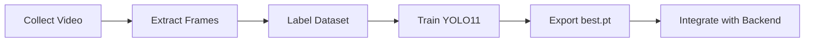
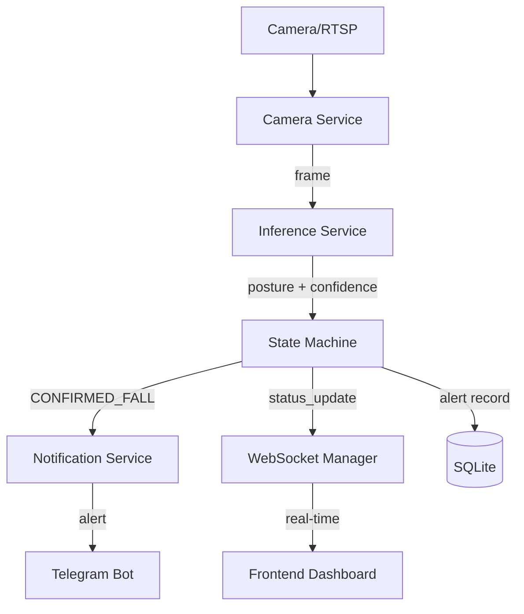
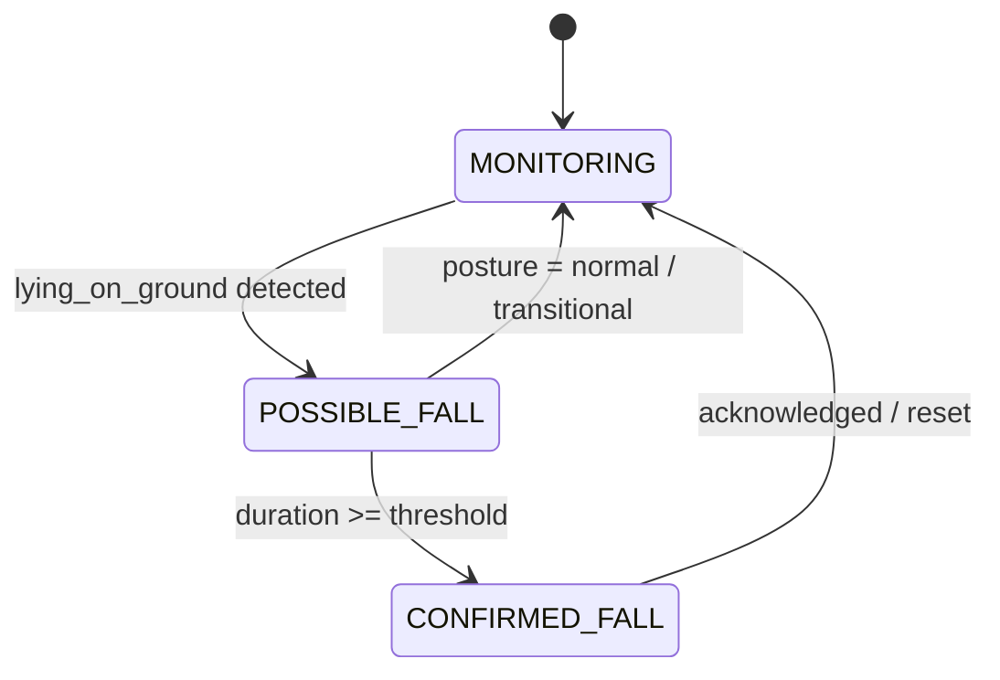

# Architecture Overview

Dokumentasi arsitektur sistem Fall Detection untuk panti jompo.

## System Overview

```
┌─────────────┐     ┌──────────────────────────────────────────────────────┐
│  IP Camera  │     │                    BACKEND (FastAPI)                  │
│  / Webcam   │────▶│                                                      │
│  (RTSP)     │     │  ┌────────────┐  ┌──────────────┐  ┌─────────────┐  │
└─────────────┘     │  │  Camera    │  │  Inference   │  │   State     │  │
                    │  │  Service   │──│  Service     │──│   Machine   │  │
                    │  │ (capture)  │  │ (YOLO11 .pt) │  │  (per cam)  │  │
                    │  └────────────┘  └──────────────┘  └──────┬──────┘  │
                    │                                           │         │
                    │                    ┌──────────────────────┤         │
                    │                    ▼                      ▼         │
                    │  ┌─────────────────────┐  ┌────────────────────┐   │
                    │  │  Notification       │  │   WebSocket        │   │
                    │  │  Service (Telegram) │  │   Manager          │   │
                    │  └─────────────────────┘  └────────┬───────────┘   │
                    │                                    │               │
                    │  ┌─────────────────────┐           │               │
                    │  │  SQLite Database    │           │               │
                    │  │  (alert history)    │           │               │
                    │  └─────────────────────┘           │               │
                    │                                    │               │
                    │  ┌─────────────────────┐           │               │
                    │  │  REST API           │           │               │
                    │  │  /api/alerts        │           │               │
                    │  │  /api/cameras       │           │               │
                    │  │  /api/settings      │           │               │
                    │  └─────────┬───────────┘           │               │
                    └────────────┼────────────────────────┼───────────────┘
                                 │                        │
                    ┌────────────┼────────────────────────┼───────────────┐
                    │            ▼          FRONTEND      ▼               │
                    │  ┌─────────────────┐  ┌────────────────────┐       │
                    │  │  API Client     │  │  WebSocket Client  │       │
                    │  │  (axios)        │  │  (auto-reconnect)  │       │
                    │  └────────┬────────┘  └────────┬───────────┘       │
                    │           │                     │                   │
                    │  ┌────────┴─────────────────────┴───────────┐      │
                    │  │              React Dashboard              │      │
                    │  │  ┌───────────┐ ┌──────────┐ ┌─────────┐ │      │
                    │  │  │ Dashboard │ │  Alert   │ │Settings │ │      │
                    │  │  │ (live)    │ │ History  │ │(thresh) │ │      │
                    │  │  └───────────┘ └──────────┘ └─────────┘ │      │
                    │  └──────────────────────────────────────────┘      │
                    └───────────────────────────────────────────────────┘
```

## Development Phase



1. **Data Collection**: Download UR Fall Detection Dataset.
2. **Frame Extraction**: `ml/scripts/extract_frames.py` → frame individual.
3. **Dedup**: `ml/scripts/dedup_check.py` → hapus frame redundan.
4. **Label Conversion**: Convert UR Fall labels (-1/0/1) ke YOLO format (0/1/2).
5. **Training**: `ml/training/train.py` dengan config di `config.yaml`.
6. **Export**: Model `best.pt` tersimpan di `ml/models/`.

## Real-Time Deployment Phase



## State Machine Diagram



## Tech Stack

| Layer     | Technology             |
|-----------|------------------------|
| ML        | YOLO11 (ultralytics)   |
| Backend   | FastAPI + uvicorn      |
| Database  | SQLite (aiosqlite)     |
| Frontend  | React + Vite           |
| Notif     | Telegram Bot API       |
| Deploy    | Docker Compose         |
